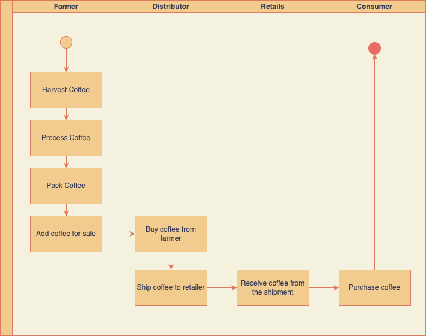
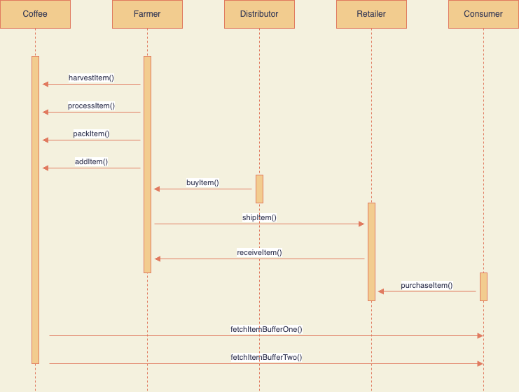
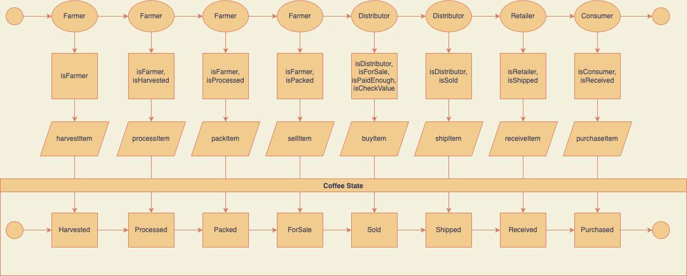
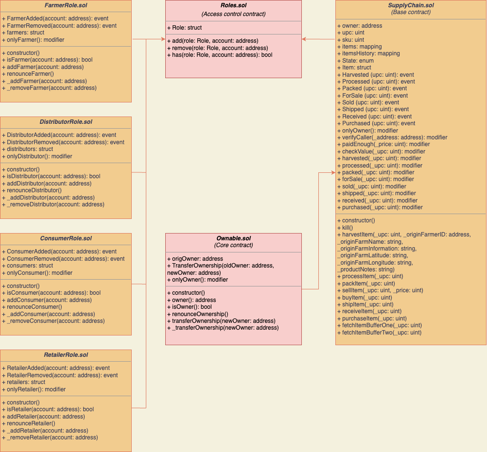
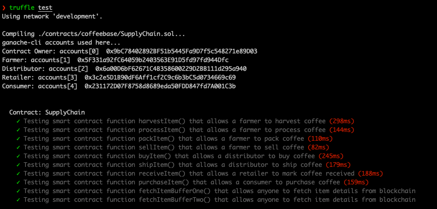
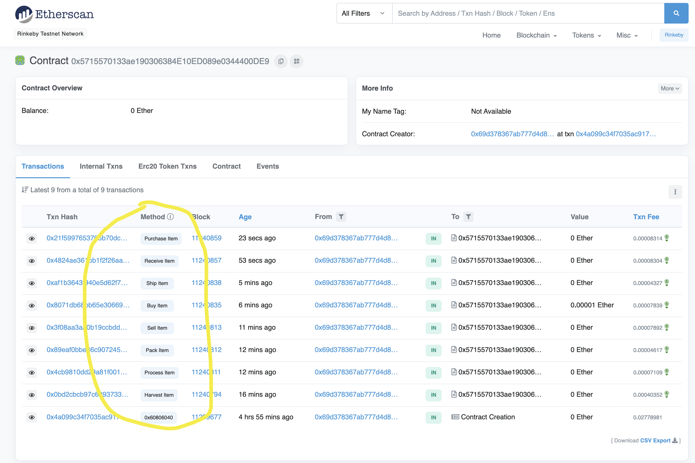

# Supply chain & data auditing

This repository containts an Ethereum DApp that demonstrates a Supply Chain flow between a Seller and Buyer. The user story is similar to any commonly used supply chain process. A Seller can add items to the inventory system stored in the blockchain. A Buyer can purchase such items from the inventory system. Additionally a Seller can mark an item as Shipped, and similarly a Buyer can mark an item as Received.


### UML

* Activity Diagram


* Sequence Diagram


* State Diagram


* Class Diagram



### DEVELOPMENT


#### Version
```
Truffle v5.0.2 (core: 5.0.2)
Solidity v0.5.0 (solc-js)
Node v11.15.0
```


#### Dependencies
For this project, you will need to have:
1. **Node and NPM** installed - NPM is distributed with [Node.js](https://www.npmjs.com/get-npm)
```bash
# Check Node version
node -v
# Check NPM version
npm -v
```
Note: Use node 11


2. **Truffle v5.X.X** - A development framework for Ethereum. 
```bash
# Unsinstall any previous version
npm uninstall -g truffle
# Install
npm install -g truffle
# Specify a particular version
sudo npm install -g truffle@5.0.2
# Verify the version
truffle version
```


#### Run Test
```
truffle test
```



#### Run web
```
npm run dev
```

#### Deploy on testnet
Contract addresses are in ContractAddress.md

```
truffle deploy --network rinkeby
```

RinkeBy Network

* FarmerRole (0xA4c2Caa92Dd45Ca1D31Bbc4731A8660E33Cc4ecf)[https://rinkeby.etherscan.io/address/0xa4c2caa92dd45ca1d31bbc4731a8660e33cc4ecf]
* DistributorRole (0xCCE513a2d81bc07076a6C7C051AC6F3D03E0a545)[https://rinkeby.etherscan.io/address/0xcce513a2d81bc07076a6c7c051ac6f3d03e0a545]
* RetailerRole (0x39FbB487e92864dF72CE50c05478f6A740B4e182)[https://rinkeby.etherscan.io/address/0x39fbb487e92864df72ce50c05478f6a740b4e182]
* ConsumerRole (0x5a38DDd8e1f7938f582c9105640bC050b545c0b2)[https://rinkeby.etherscan.io/address/0x5a38ddd8e1f7938f582c9105640bc050b545c0b2]
* SupplyChain (0x5715570133ae190306384E10ED089e0344400DE9)[https://rinkeby.etherscan.io/address/0x5715570133ae190306384e10ed089e0344400de9]


### Result for web intereaction with Rinkeby



* Harvested (https://rinkeby.etherscan.io/tx/0x0bd2cbcb97c699373333471e0a0ad9ecf6ef8c35bf601d03f2e544d6360c06c1)
* Processed (https://rinkeby.etherscan.io/tx/0x4cb9810dd29a81f0011d8a7411cd6a891fe058f4bb2be59c1377e7659f7326d2)
* Packed (https://rinkeby.etherscan.io/tx/0x89eaf0bbe86c907245bb7fb60b34e03c5bd8f6c32febf17404afd731627dcf1d)
* Sold (https://rinkeby.etherscan.io/tx/0x3f08aa3aa0b19ccbdd32c368719e5e299702c897e38f05a858713d5318eae75a)
* Buy (https://rinkeby.etherscan.io/tx/0x8071db68bb65e30669bc7e35b1b6c40e2356f7dddeddaaa706c64e8c4d7b3b0c)
* Shipped (https://rinkeby.etherscan.io/tx/0xaf1b3643f940e5d62f79fe2f5f8adff6fa3be34a81d676300349e778db908aee)
* Received (https://rinkeby.etherscan.io/tx/0x4824ae361bb1f2f26aa457fdd8ce898cd2560fd97914520806289ff521c34756)
* Purchased (https://rinkeby.etherscan.io/tx/0x21f5997653705b70dc11689fedaa646ad142c4880bbb6c82ecba0e8cd35d4fb2)